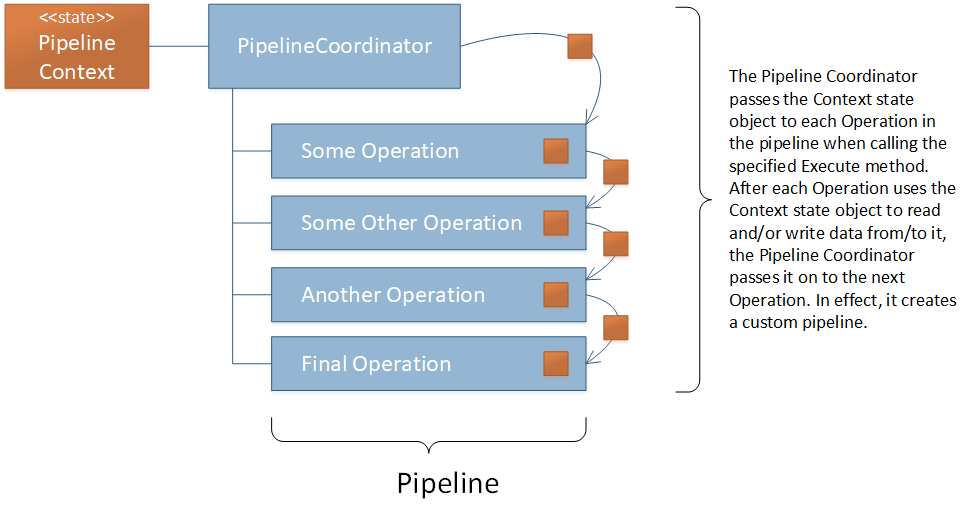
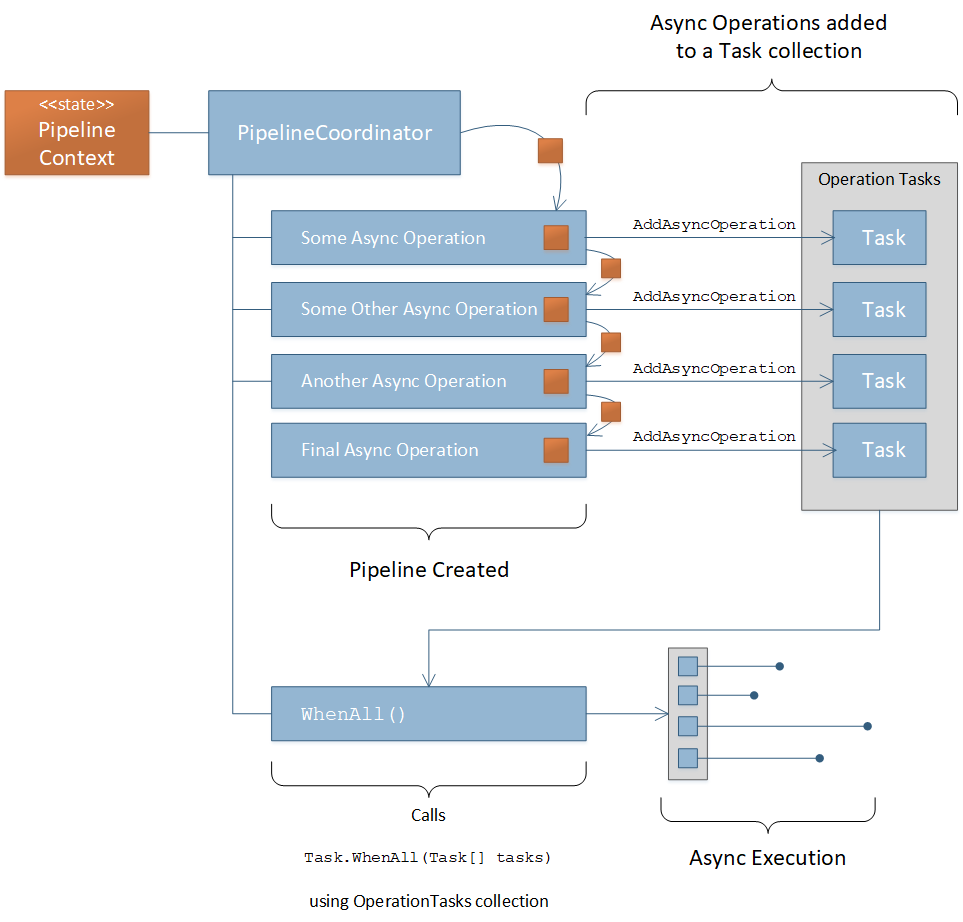

============
How It Works
============

The core of the Pipelines framework is a model that combines the `Builder Pattern <https://www.dofactory.com/net/builder-design-pattern/>`_ 
and the `Chain of Responsibility Pattern <https://www.dofactory.com/net/chain-of-responsibility-design-pattern/>`_ . However, they are not 
implemented exactly as those patterns prescribe but are instead derived from them. 

The Builder Pattern is a Creational Pattern whereas the Chain of Responsibility Pattern is a Behavioral Pattern. The Pipelines framework
provides the ability to build a pipeline (Builder) through the manual execution of each operation in the pipeline (Chain of Responsibility). 
Therefore, the :doc:`pipeline-coordinator` serves as both the Director of the Builder Pattern and the head of the Chain of Responsibility.

In this implementation, the :doc:`pipeline-coordinator` does the job of executing each successor and passing the state object to each 
Concrete Handler in the Chain. In the original Chain of Responsibility Pattern, each handler would have to call its successor and pass the
state object down. In the Pipelines framework the individual Operations (i.e. Handlers) don't have to worry about calling the next operation
in the chain (i.e. successor) nor do they have to worry about passing the state object down. This is all handled by the 
:doc:`pipeline-coordinator` implemented as part of the framework.

The diagram below depicts the flow of the Pipelines framework model. 

The diagram above depicts the code below.

.. code-block:: csharp
   :linenos:
   
   // The state object is in the _pipelineCoordinator.Context property 
   
   _pipelineCoordinator
        .Execute<ISomeOperation>()
        .Execute<ISomeOtherOperation>()
        .Execute<IAnotherOperation>()
        .Execute<IFinalOperation>()
   ;
   
   // Do something with the results in the state object 
   return _pipelineCoordinator.Context.Stuff;
   
You can also execute asynchronous operations in the following ways.

* ExecuteAsync<TOperation>
  This executes the async operation and awaits it before moving to the next operation
  
* AddAsyncOperation<TOperation> with WhenAll()
  Each call to the ``AddAsyncOperation`` method adds the Operation's Task to the ``OperationTasks`` collection. Therein the collection 
  accumulates the number of Tasks added. After all the desired async Operation tasks have been added to the collection, a call to the
  ``WhenAll()`` method will await all of those tasks and return to the pipeline when all the tasks have run to completion or faulted. 
  Once the task collection has been awaited, then the :doc:`pipeline-coordinator` clears the ``OperationTasks`` collection so that 
  new asynchronous tasks can be added if so desired. 
  
.. warning::

   If there are any pending Tasks in the ``OperationTasks`` collection, then you cannot call ``ExecuteAsync<TOperation>`` until those 
   pending tasks have been awaited and the ``OperationTasks`` collection is cleared. Attempting to do that will throw an exception.
   
The diagram below depicts the flow of asynchronous execution in the Pipelines framework. 

The diagram above depicts the code below. 

.. code-block:: csharp
   :linenos:
   
   // The state object is in the _pipelineCoordinator.Context property 
   
   _pipelineCoordinator
   
        // Add the operation tasks to the OperationTasks collection 
        .AddAsyncOperation<ISomeOperationAsync>()
        .AddAsyncOperation<ISomeOtherOperationAsync>()
        .AddAsyncOperation<IAnotherOperationAsync>()
        .AddAsyncOperation<IFinalOperationAsync>()
        
        // Execute pending tasks asynchronously 
        .WhenAll()
        
   ;
   
   // Do something with the results in the state object
   return _pipelineCoordinator.Context.Stuff;
   
With this framework you can mix synchronous Operation with asynchronous Operations if some things are dependent on others but parts
of the application logic can be combined asynchronously.

.. code-block:: csharp 
   :linenos:
   
   // The state object is in the _pipelineCoordinator.Context property 
   
   _pipelineCoordinator
   
        // These operations executed one at a time in order 
        .Execute<IPreliminaryOperation>()
        .ExecuteAsync<ISomeFetchOperationAsync>()
        
        // These tasks can be executed asynchronously
        .AddAsyncOperation<ISomeOperationAsync>()
        .AddAsyncOperation<ISomeOtherOperationAsync>()
        .AddAsyncOperation<IAnotherOperationAsync>()
        .AddAsyncOperation<IFinalOperationAsync>()
        .WhenAll()
        
        // Continue with other synchronous operations 
        .Execute<ICalculationOperation>()
        .ExecuteAsync<ISomeSaveOperationAsync>()
        
   ;
   
   // Do something with the results in the state object 
   return _pipelineCoordinator.Context.Stuff;
   
You can see from the code above that if there is an opportunity to optimize performance of the process by identifying and combining
asynchronous operations you can do so using the ``AddAsyncOperation<TOperation>`` with ``WhenAll()`` combination before, after, or 
in between synchronous operations.
   
